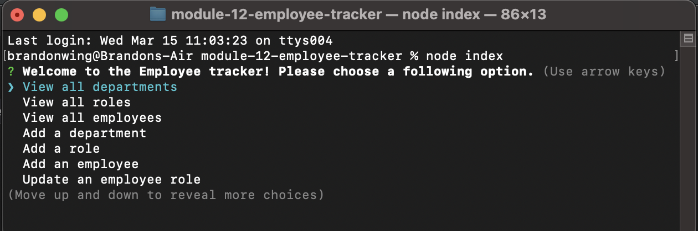

# Database for Employee Tracking

## Description
  This application utilizes InquirerJS and MYSQL to create a database for a company containing its departments, roles, and employees as well as information regarding the employees and roles. Data can be added, viewed, and updated by navigating through the prompts.

# Table of Contents

- [Installation](#installation)
- [Usage](#usage)
- [Screenshot](#screenshot)
- [Walkthrough Video](#walkthrough-video)
- [Credits](#credits)
- [Contributions](#contributions)
- [Tests](#tests)

## Installation
  1. Clone the reposition. Install the necessary packages using npm commands. 3. Open the application using nodeJS.
## Usage
  One could use this to store and organize employee information.

## Screenshot
Below is a screenshot of the opened application and a link to the walkthrough video

## Walkthrough Video
https://www.youtube.com/watch?v=ugfgrQgisKk
## Credits
https://github.com/rudyxwhite

## Contact Information
  brandonrwing98@gmail.com
       
## Contributions
  No contributions allowed at this time.

## Tests
  No tests at the moment.
